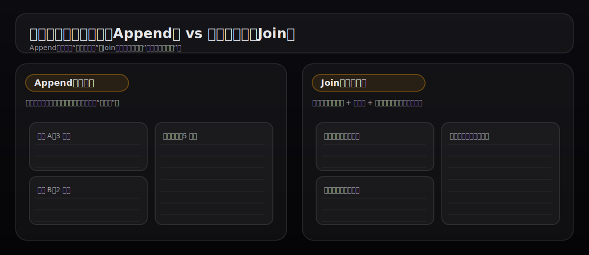
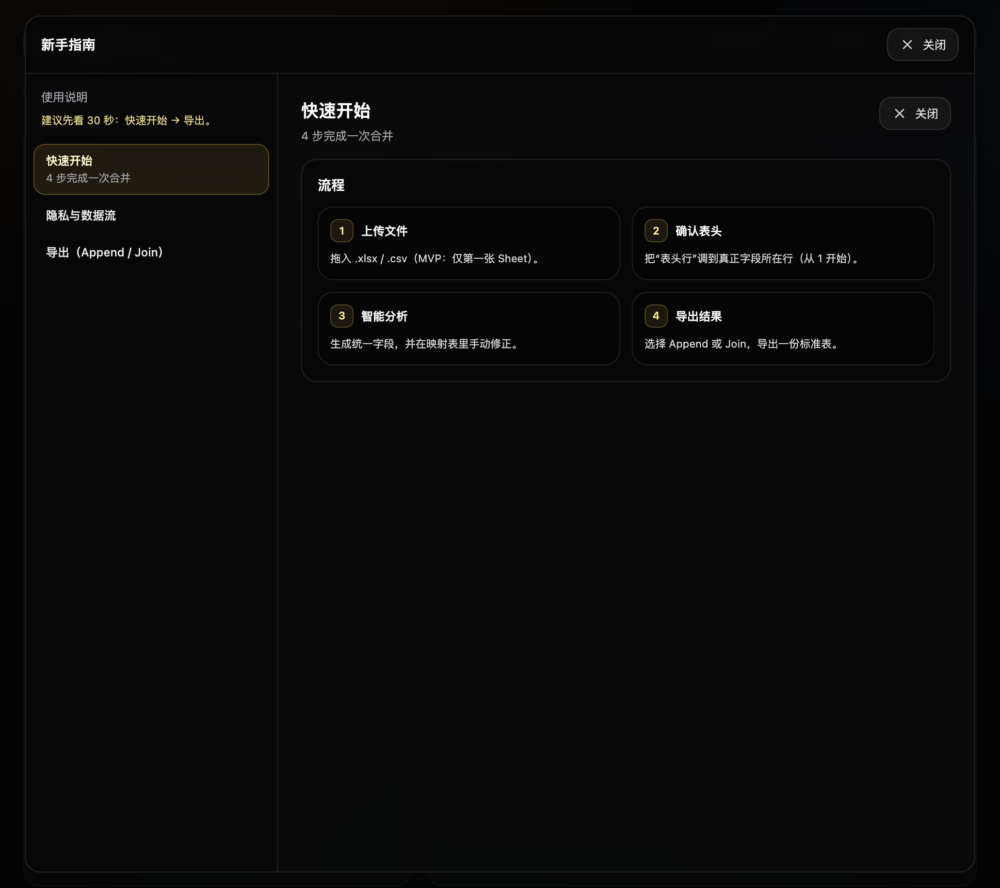
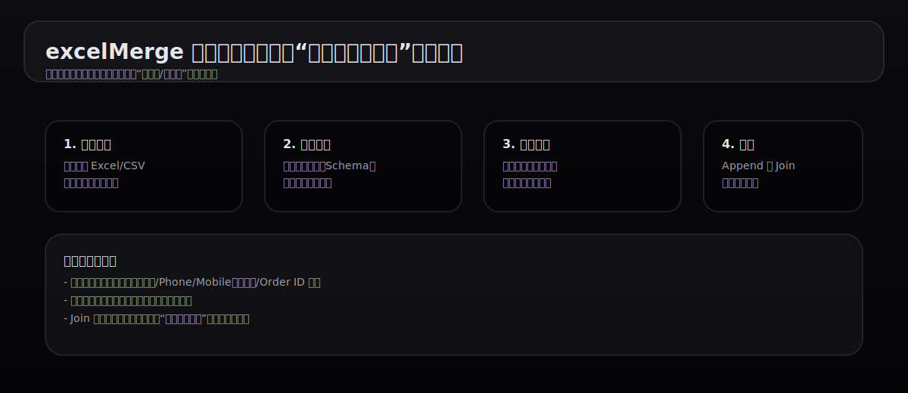
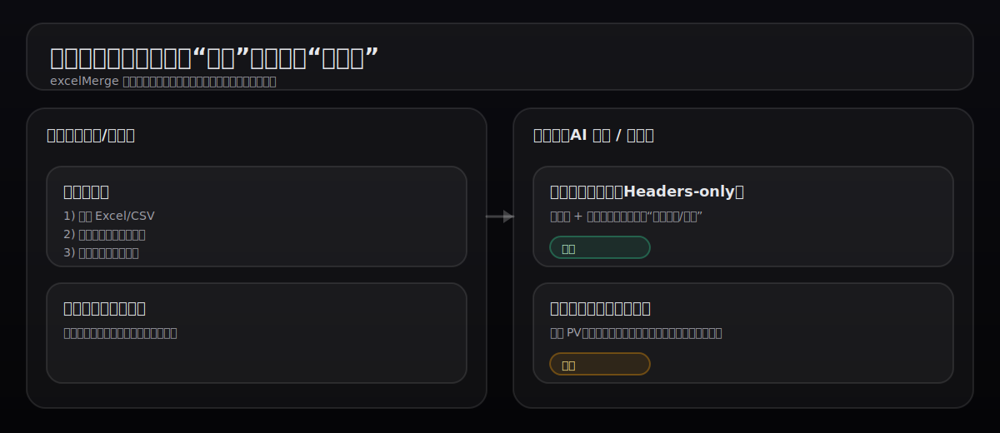

# excelMerge 前台使用手册（图文版）

适用人群：运营/财务/数据分析/行政等需要处理多份 Excel/CSV 导出表的用户  
核心目标：把多份“表头不一致、结构混乱”的导出表，快速合并成一张“标准表”，用于分析/对账/导入系统。

---

## 1. 你能用它解决什么问题？

你可能遇到过这些典型痛点：
- 同一个字段在不同导出里叫法不同：手机号 / Mobile / Phone，订单号 / Order ID / 订单编号
- 多个平台导出列顺序不同、缺列、同义列混在一起
- 人工改表头、复制粘贴合并很慢，而且容易错列、漏列
- 对账类场景需要“按主键把多表拼到同一行”，手工做 Join 非常费劲

excelMerge 提供两类导出模式：
- **Append（追加合并）**：把多张表的行纵向叠加，适合生成“明细表”
- **Join（按主键合并）**：按主键把多张表合成“一行一条记录”，适合对账/汇总

---

## 2. 产品页面长什么样？

### 2.1 首页（入口）

点击“开始免费使用”进入工作区。

### 2.2 工作区（核心操作区域）

工作区包含：上传区、映射区、导出区，以及右上角的“新手指南 / 评价建议 / 登录”等入口。

### 2.3 新手指南（第一次进入会自动弹出）

你也可以随时点右上角“新手指南”打开。

---

## 3. 使用流程（从 0 到导出）

下面按实际操作展开说明。

---

## 4. 第一步：上传文件

### 4.1 支持的文件
- 支持 `.xlsx`、`.csv`
- MVP 版本：仅处理第一张 Sheet（第一张工作表）

### 4.2 上传方式
- 直接拖拽文件到上传区域
- 或点击上传区域选择文件

### 4.3 表头行（非常重要）
很多导出表第一行不是表头，而是标题/说明/时间戳。  
你需要在每个文件的卡片里把“表头行”调到真正字段所在行（从 1 开始）。

建议经验：
- 真正表头通常是“文字型字段”居多（如：订单号、手机号、金额等）
- 如果某一行大多数是数字/空白，它很可能不是表头

---

## 5. 第二步：智能分析与字段映射

点击“智能分析与映射”，系统会：
- 汇总所有文件的表头
- 生成一套“统一字段”（Unified Schema）
- 给出每个文件到统一字段的映射建议

你会看到一个“映射表格”：
- 左侧是统一字段
- 每个文件占一列
- 每个单元格表示“该文件的哪一列 → 映射到该统一字段”

### 5.1 如何手动校正映射？
点击任意单元格，选择正确的原始字段或“未映射”。

常见校正建议：
- 把不同叫法的同义字段统一到同一个字段（手机号/电话/Mobile → phone_number）
- 明确主键字段（订单号/客户ID/手机号），为 Join 做准备
- 对不需要的列直接不映射（减少导出后的噪音列）

---

## 6. 第三步：保存模板（强烈推荐）

如果你经常处理相似结构的导出（例如每天的订单导出），建议保存模板：
- 下一次上传同结构文件，会自动识别并提示“发现模板”
- 直接应用模板即可跳过重复映射

模板存储说明：
- 默认保存在本地浏览器（Local Storage）
- 清理浏览器缓存/无痕模式/换电脑会导致模板丢失（属于正常现象）

---

## 7. 第四步：导出（Append / Join）

### 7.1 Append 追加合并（纵向拼接）
适用：你要做一张“明细表”，例如把多个渠道的订单明细合成一个表。

导出特点：
- 每个文件的行都会被追加到结果表里
- 结果会带 `_source_file` 标记来源文件

### 7.2 Join 按主键合并（横向拼接）
适用：对账/汇总，例如：
- 订单表（订单号、金额） + 回款表（订单号、回款时间） + 客户表（客户ID、手机号）

关键要求：
- 你必须选择一个“主键字段”
- 任意一个文件如果缺少主键映射，会禁止导出（避免生成全空或错位结果）

合并策略（当前版本）：
- “先到先得 + 后到补空”：已有值不覆盖，后续文件只补充空字段

---

## 8. 隐私与安全（一定要读）

简述：
- 文件内容在本地读取、合并、导出
- 发送到服务端用于建议映射的仅包含：文件名 + 表头（headers）
- 不上传原始行数据（例如订单明细、客户信息等）

---

## 9. 常见问题（FAQ）

### 9.1 点“分析”没反应 / 分析失败
可能原因：
- 后端服务不可用（开发默认 `http://localhost:3000`，生产由 `VITE_API_BASE` 指定）
- 网络被限制（公司代理/安全软件拦截）

处理建议：
- 先确认你能打开首页并正常进入工作区
- 如果是自部署，检查后端服务是否正常运行（能访问 `/` 健康检查）

### 9.2 Join 导出时报“缺少主键映射”
说明至少有一个文件没有把“主键字段”映射到任何原始列。
处理方法：
- 回到映射表，找到主键字段对应行
- 在缺失的文件列里选择正确的原始字段

### 9.3 结果里出现 `_source_file` / `_source_files`
这是为了追溯数据来源：
- Append 会加 `_source_file`
- Join 会加 `_source_files`

---

## 10. 给新用户的 30 秒建议
- 第一次先用 **Append** 跑通流程（更直观）
- 第二次再用 **Join** 做对账（先选好主键字段）
- 做一次“手动校正映射”后立刻保存模板，下次会省很多时间

